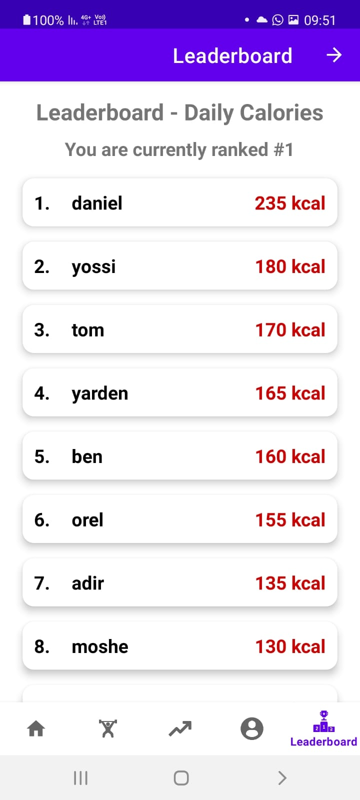

## FitTrack

## Project Description:

FitTrack is an Android application designed to track users' fitness and health metrics. The app allows users to log and monitor data such as, calories burned, and other measurements to improve overall fitness and well-being.

## Key Features

- Calorie calculation based on user activity.

- Graphs and statistics to visualize progress.

- Personal goal setting and tracking.

## System Requirements

- Android 6.0 or higher.

- Internet connection for syncing and backup features.

## Installation

1. Clone the repository: 
    git clone https://github.com/danielgerbi7/Android-FinalProject.git

2. Open the project in Android Studio.

3. Build the project and install it on an Android device or emulator.

## Usage

1. Open the application.

2. Sign up or log in to an existing account.

3. Enter personal fitness data.

4. Track progress through graphs and statistics.

## Contributing

Contributions to the project are welcome. You can fork the repository, make modifications, and submit a pull request with your proposed changes.

## Game Screens

**1. Splash Screen**

|  |
|------------------------------------------------------------------------------------|

**2. Login Screen**

|  |
|----------------------------------------------------------------------------------|

**3. Home Screen**

|  |
|--------------------------------------------------------------------------------|

**4. Workout Plans Screens**

|  |
|------------------------------------------------------------------------------------|

|  |
|-------------------------------------------------------------------------------------------|

|  |
|--------------------------------------------------------------------------------------|

**5. Progress Screen**

|  |
|----------------------------------------------------------------------------------------|

**6. Profile Screen**

|  |
|--------------------------------------------------------------------------------------|

**7. LeaderBoard Screen**

|  |
|---------------------------------------------------------------------------------|

## Author

[Daniel Gerbi](https://github.com/danielgerbi7)